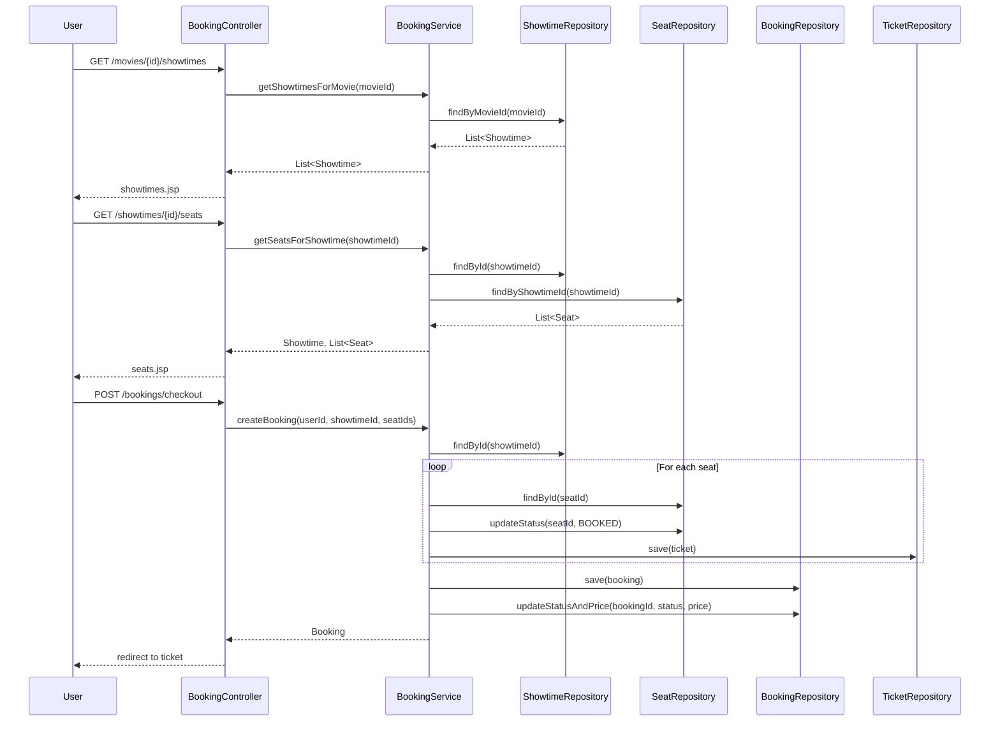

# System Architecture

## System Overview

Showspace is a monolithic Spring MVC web application for movie ticket booking. The application follows a layered architecture pattern with clear separation of concerns between presentation, business logic, and data access layers. The system uses PostgreSQL as its primary database and JSP for server-side rendering of views.

## Architecture Diagram

```mermaid
flowchart TB
    subgraph "Web Layer"
        HC["HomeController"]
        CC["CatalogController"]
        BC["BookingController"]
    end
    
    subgraph "Service Layer"
        CS["CatalogService"]
        BS["BookingService"]
    end
    
    subgraph "Repository Layer"
        MR["MovieRepository"]
        BR["BookingRepository"]
        SR["ShowtimeRepository"]
        SeR["SeatRepository"]
        TR["TicketRepository"]
    end
    
    subgraph "Database"
        PG["PostgreSQL"]
    end
    
    HC -->|/home| Web[Web Browser]
    CC -->|/movies/now-showing| Web
    CC -->|/movies/coming-soon| Web
    CC -->|/movies/{id}| Web
    BC -->|/movies/{id}/showtimes| Web
    BC -->|/showtimes/{id}/seats| Web
    BC -->|/bookings/checkout| Web
    BC -->|/bookings/{id}/ticket| Web
    
    CC --> CS
    BC --> BS
    
    CS --> MR
    BS --> BR
    BS --> SR
    BS --> SeR
    BS --> TR
    
    MR --> PG
    BR --> PG
    SR --> PG
    SeR --> PG
    TR --> PG
```

## Component Descriptions

### HomeController
- **Purpose**: Serves as the application entry point
- **Responsibilities**: Display home page with welcome message
- **Dependencies**: None
- **Type**: Application

### CatalogController
- **Purpose**: Handles movie browsing and display operations
- **Responsibilities**: 
  - Display now showing movies
  - Display coming soon movies
  - Show movie details
- **Dependencies**: CatalogService
- **Type**: Application

### BookingController
- **Purpose**: Manages the booking workflow
- **Responsibilities**:
  - Display showtimes for a movie
  - Display available seats for a showtime
  - Process booking checkout
  - Display ticket confirmation
- **Dependencies**: BookingService
- **Type**: Application

### CatalogService
- **Purpose**: Business logic for movie catalog operations
- **Responsibilities**:
  - Retrieve movies by status
  - Get movie details
- **Dependencies**: MovieRepository
- **Type**: Application

### BookingService
- **Purpose**: Business logic for booking operations
- **Responsibilities**:
  - Get showtimes for a movie
  - Get seats for a showtime
  - Process booking with seat locking
  - Calculate ticket prices
  - Generate ticket codes
- **Dependencies**: ShowtimeRepository, SeatRepository, BookingRepository, TicketRepository
- **Type**: Application

### MovieRepository
- **Purpose**: Data access for movie entities
- **Responsibilities**: CRUD operations for movies
- **Dependencies**: PostgreSQL
- **Type**: Application

### BookingRepository
- **Purpose**: Data access for booking entities
- **Responsibilities**: CRUD operations for bookings
- **Dependencies**: PostgreSQL, JdbcTemplate
- **Type**: Application

### ShowtimeRepository
- **Purpose**: Data access for showtime entities
- **Responsibilities**: Query showtimes by movie
- **Dependencies**: PostgreSQL
- **Type**: Application

### SeatRepository
- **Purpose**: Data access for seat entities
- **Responsibilities**: Query seats by showtime, update seat status
- **Dependencies**: PostgreSQL, JdbcTemplate
- **Type**: Application

### TicketRepository
- **Purpose**: Data access for ticket entities
- **Responsibilities**: CRUD operations for tickets
- **Dependencies**: PostgreSQL
- **Type**: Application

## Data Flow

### Booking Flow Sequence



## Integration Points

### External APIs
- None currently implemented

### Databases
- **PostgreSQL** - Primary database for all entities (movies, showtimes, seats, bookings, tickets)

### Third-party Services
- None currently implemented

## Infrastructure Components

- **Deployment Model**: WAR file deployed to external servlet container (Tomcat, Jetty, etc.)
- **Networking**: Standard HTTP/HTTPS on port 8080 (default servlet container port)
- **No CDK/Terraform infrastructure** - Traditional deployment model