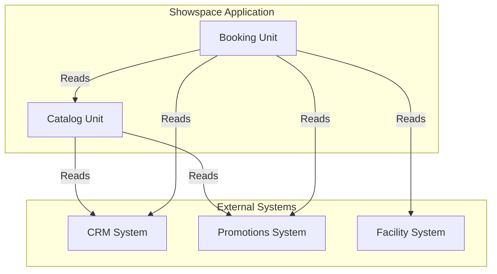

# Business Overview

## Business Context Diagram

## Business Description

**Showspace** is a movie ticket booking application that allows customers to browse movies, select showtimes, reserve seats, and purchase tickets. The system integrates with external systems for customer relationship management (CRM), promotions, and facility/cinema data.

### Business Transactions

1. **Browse Movies** - View movies currently playing and upcoming releases
2. **View Movie Details** - See comprehensive information about a specific movie
3. **Select Showtime** - Choose a date and time for a movie showing
4. **Select Seats** - Pick preferred seats from a seating chart
5. **Book Tickets** - Complete purchase and generate digital tickets
6. **View Ticket** - Access digital ticket with QR/barcode for cinema entry

### Business Dictionary

| Term | Meaning |
|------|---------|
| Movie | A film available for viewing in cinemas |
| Showtime | A scheduled screening of a movie at a specific cinema |
| Seat | A physical location in a cinema theater |
| Booking | A customer's reservation for one or more seats |
| Ticket | A digital pass generated from a booking for cinema entry |
| Movie Status | Lifecycle state: COMING_SOON, NOW_SHOWING, ARCHIVED |
| Seat Status | Availability state: AVAILABLE, BOOKED |
| Booking Status | Transaction state: PENDING, CONFIRMED |

## Component Level Business Descriptions

### Catalog Unit
- **Purpose**: Manages movie content, metadata, and lifecycle states
- **Responsibilities**: 
  - Store and retrieve movie information
  - Track movie status (Coming Soon vs Now Showing)
  - Manage movie formats and languages
  - Provide read-optimized movie listings

### Booking Unit
- **Purpose**: Handles transactional booking operations
- **Responsibilities**:
  - Manage showtime availability
  - Handle seat reservation concurrency
  - Calculate ticket prices
  - Generate digital tickets
  - Track booking status

### Integration Points
- **Catalog Unit** reads from: CRM (customer data), Promotions (discounts), Facility (cinema data)
- **Booking Unit** reads from: Catalog (movie info), Facility (cinema data), CRM (customer data), Promotions (pricing modifiers)