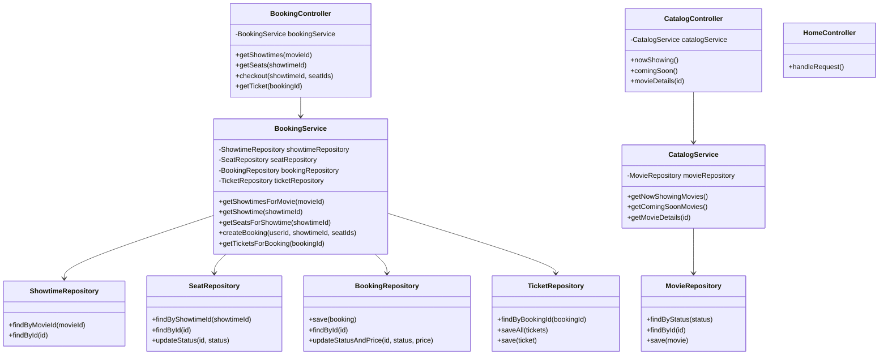

# Code Structure

## Build System

- **Type**: Maven
- **Configuration**: 
  - `pom.xml` - Project configuration with dependencies and build settings
  - Java 1.8 target
  - Spring Framework 5.3.31
  - PostgreSQL JDBC Driver 42.7.2
  - Servlet API 4.0.1
  - JSTL 1.2

## Key Classes/Modules

## Existing Files Inventory

### Controllers
- `src/main/java/com/ntq/showspace/controller/HomeController.java` - Entry point controller
- `src/main/java/com/ntq/showspace/catalog/controller/CatalogController.java` - Movie browsing endpoints
- `src/main/java/com/ntq/showspace/booking/controller/BookingController.java` - Booking workflow endpoints

### Services
- `src/main/java/com/ntq/showspace/catalog/service/CatalogService.java` - Movie catalog business logic
- `src/main/java/com/ntq/showspace/booking/service/BookingService.java` - Booking business logic with transaction management

### Repositories (Interfaces)
- `src/main/java/com/ntq/showspace/catalog/repository/MovieRepository.java` - Movie data access interface
- `src/main/java/com/ntq/showspace/booking/repository/BookingRepository.java` - Booking data access interface
- `src/main/java/com/ntq/showspace/booking/repository/ShowtimeRepository.java` - Showtime data access interface
- `src/main/java/com/ntq/showspace/booking/repository/SeatRepository.java` - Seat data access interface
- `src/main/java/com/ntq/showspace/booking/repository/TicketRepository.java` - Ticket data access interface

### Repositories (Implementations)
- `src/main/java/com/ntq/showspace/catalog/repository/MovieRepositoryImpl.java`
- `src/main/java/com/ntq/showspace/booking/repository/BookingRepositoryImpl.java`
- `src/main/java/com/ntq/showspace/booking/repository/ShowtimeRepositoryImpl.java`
- `src/main/java/com/ntq/showspace/booking/repository/SeatRepositoryImpl.java`
- `src/main/java/com/ntq/showspace/booking/repository/TicketRepositoryImpl.java`

### Models
- `src/main/java/com/ntq/showspace/catalog/model/Movie.java` - Movie aggregate root
- `src/main/java/com/ntq/showspace/catalog/model/MovieMetadata.java` - Movie metadata value object
- `src/main/java/com/ntq/showspace/catalog/model/MovieFormatMapping.java` - Movie format mapping
- `src/main/java/com/ntq/showspace/catalog/model/MovieStatus.java` - Movie lifecycle status enum
- `src/main/java/com/ntq/showspace/catalog/model/ShowtimeReadModel.java` - Read model for showtimes
- `src/main/java/com/ntq/showspace/booking/model/Booking.java` - Booking entity
- `src/main/java/com/ntq/showspace/booking/model/BookingStatus.java` - Booking status enum
- `src/main/java/com/ntq/showspace/booking/model/Seat.java` - Seat entity
- `src/main/java/com/ntq/showspace/booking/model/SeatStatus.java` - Seat status enum
- `src/main/java/com/ntq/showspace/booking/model/Showtime.java` - Showtime entity
- `src/main/java/com/ntq/showspace/booking/model/Ticket.java` - Ticket entity

### Views (JSP)
- `src/main/webapp/WEB-INF/views/home.jsp` - Home page
- `src/main/webapp/WEB-INF/views/catalog/now_showing.jsp` - Now showing movies list
- `src/main/webapp/WEB-INF/views/catalog/coming_soon.jsp` - Coming soon movies list
- `src/main/webapp/WEB-INF/views/catalog/movie_details.jsp` - Movie details page
- `src/main/webapp/WEB-INF/views/booking/showtimes.jsp` - Showtimes list
- `src/main/webapp/WEB-INF/views/booking/seats.jsp` - Seat selection
- `src/main/webapp/WEB-INF/views/booking/ticket.jsp` - Ticket confirmation

### Configuration
- `src/main/webapp/WEB-INF/web.xml` - Web application configuration
- `src/main/webapp/WEB-INF/app-servlet.xml` - Spring MVC configuration
- `src/main/webapp/WEB-INF/app-context.xml` - Spring application context with data source

### Database
- `src/main/resources/schema.sql` - Database schema definition
- `src/main/resources/data.sql` - Initial data seed script

## Design Patterns

### Dependency Injection
- **Location**: Spring framework configuration
- **Purpose**: Inversion of control for service and repository components
- **Implementation**: Constructor injection in services and controllers

### Repository Pattern
- **Location**: Repository interfaces and implementations
- **Purpose**: Abstract data access layer
- **Implementation**: JdbcTemplate for data access

### Service Layer Pattern
- **Location**: Service classes
- **Purpose**: Encapsulate business logic
- **Implementation**: Stateful services with transaction management

### MVC Pattern
- **Location**: Controller classes
- **Purpose**: Separate presentation from business logic
- **Implementation**: Spring MVC with JSP views

## Critical Dependencies

### Spring Framework
- **Version**: 5.3.31
- **Usage**: Core framework for dependency injection, MVC, and transaction management
- **Purpose**: Application infrastructure

### PostgreSQL JDBC Driver
- **Version**: 42.7.2
- **Usage**: Database connectivity
- **Purpose**: Access PostgreSQL database

### Servlet API
- **Version**: 4.0.1
- **Usage**: Web request handling
- **Purpose**: Standard Java web API

### JSTL
- **Version**: 1.2
- **Usage**: JSP tag libraries
- **Purpose**: Simplified JSP development