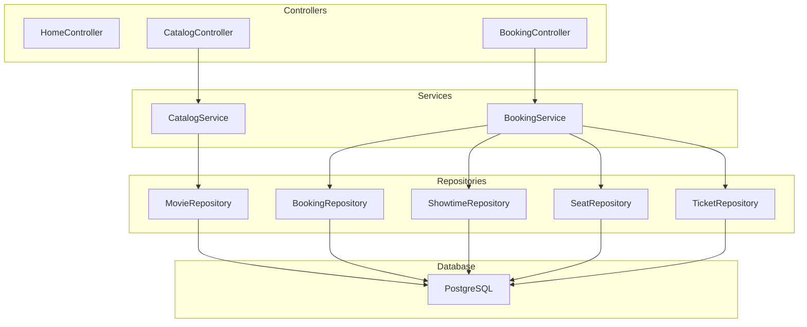

# Dependencies

## Internal Dependencies

### CatalogService depends on MovieRepository
- **Type**: Compile/Runtime
- **Reason**: Data access for movie entities

### BookingService depends on ShowtimeRepository
- **Type**: Compile/Runtime
- **Reason**: Data access for showtime entities

### BookingService depends on SeatRepository
- **Type**: Compile/Runtime
- **Reason**: Data access for seat entities and status updates

### BookingService depends on BookingRepository
- **Type**: Compile/Runtime
- **Reason**: Data access for booking entities

### BookingService depends on TicketRepository
- **Type**: Compile/Runtime
- **Reason**: Data access for ticket entities

## External Dependencies

### Spring Framework
- **Version**: 5.3.31
- **Purpose**: Core framework for dependency injection, MVC, and transaction management
- **License**: Apache License 2.0

### PostgreSQL JDBC Driver
- **Version**: 42.7.2
- **Purpose**: Database connectivity to PostgreSQL
- **License**: BSD-2-Clause

### Servlet API
- **Version**: 4.0.1
- **Purpose**: Standard Java web API for request/response handling
- **License**: CDDL/GPL

### JSTL
- **Version**: 1.2
- **Purpose**: JSP tag libraries for simplified view development
- **License**: CDDL/GPL